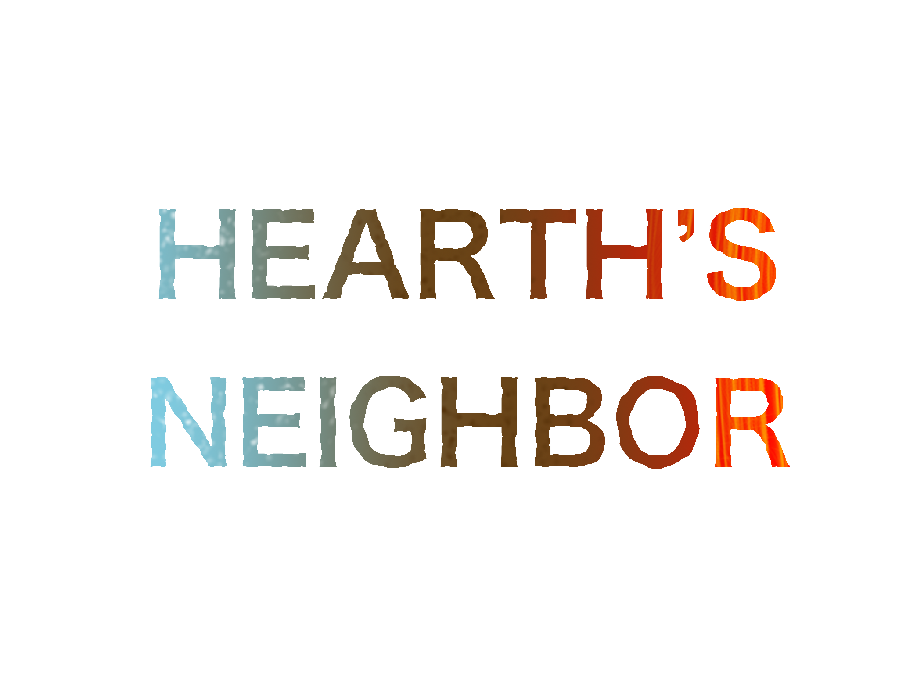

# HEARTH'S NEIGHBOR

The museum has an interesting alien plate on display in the back...now that you've got access to warp technology, perhaps you figure out where it came from?
To start the mod, find the new exhibit in the museum.

Made for the 2023 Outer Wilds Summer Jam

Credits:
* FunkyShoeMan: Some models, including a dock model that was made before the jam
* Lumine0409: Ship Log Map Mode icons and main logo
* EndgameZero: Music. You can listen to the soundtrack [here!](https://youtu.be/WfaBq_FN-ko)
* GameWyrm: Literally everything else
* Metrocop12: Russian translation
* Luke Hakurei: French translation
* Orclecle: Japanese translation
* mashroom: Simplified Chinese translation

A few sounds were taken from FreeSound.

For help with the mod, please contact GameWyrm on the Outer Wilds modding Discord.

This mod is considered finished for the forseeable future due to lack of interest in development. The mod does have a clear ending, though the original intended ending was cut. However, the story is now resolved in the sequel, [Hearth's Neighbor 2: Magistarium](https://outerwildsmods.com/mods/hearthsneighbor2magistarium/)!

This mod was the first place winner for the Outer Wilds Summer Modding Jam 2023. Thanks to everyone who played and gave feedback for the updates that came out afterwards!
